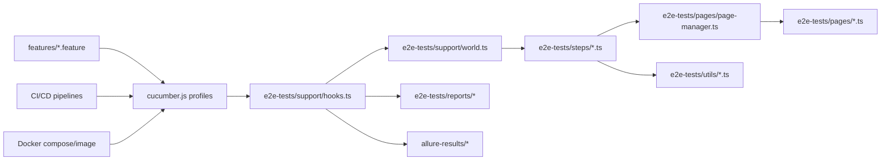
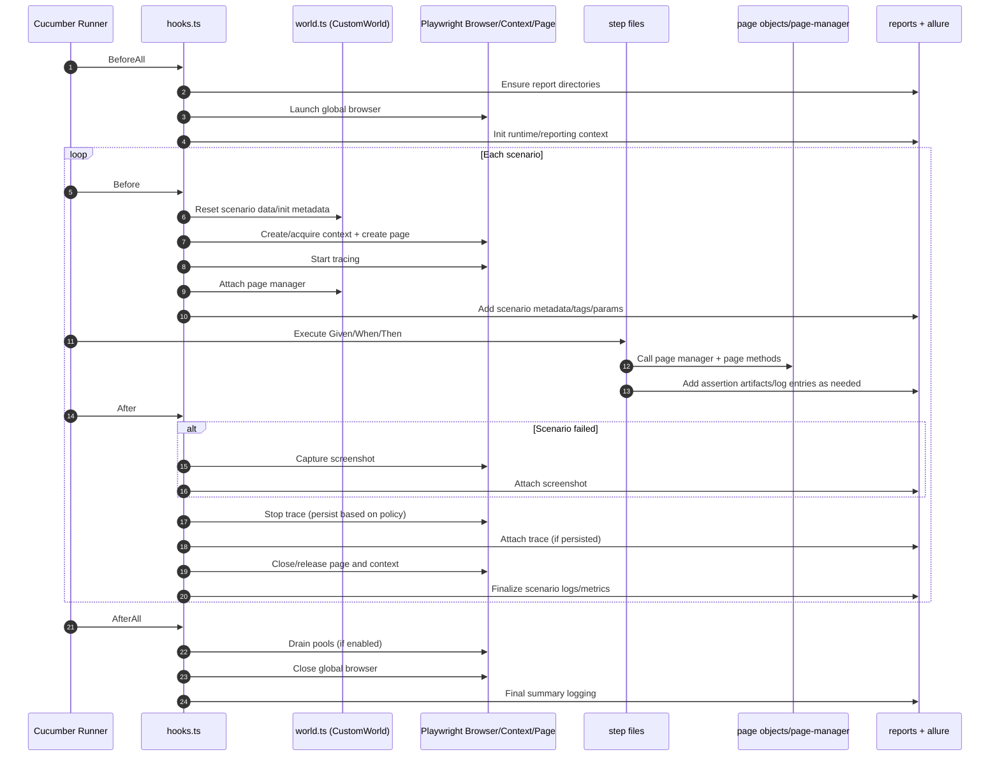
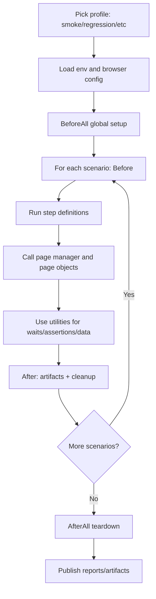

# Framework Architecture Handbook

## Purpose
This handbook explains the architecture of the Books Inventory UI automation framework so new and existing team members can onboard quickly, contribute safely, and reason about runtime behavior.

This repository is a Cucumber-first TypeScript E2E framework that uses Playwright as the browser engine and Allure/Cucumber outputs for reporting.

---

## 1) Architecture At A Glance

### Core principles
- Cucumber is the primary test runner and BDD contract layer.
- TypeScript provides type safety for pages, steps, world state, and utilities.
- Page Object Model (POM) separates selectors/interactions from step intent.
- `World` stores scenario-scoped state to avoid global test coupling.
- Hooks orchestrate setup/teardown and artifact collection.
- Utilities centralize reusable behavior (assertions, waits, resilience, data, logging).

### High-level component diagram



---

## 2) Why This Stack

## Cucumber
- Gives executable acceptance criteria in business-readable Gherkin.
- Supports profile-driven execution (`smoke`, `regression`, `security`, etc.).
- Integrates naturally with hooks and scenario state (`World`).

## TypeScript
- Catches refactor issues early (compile-time safety).
- Improves maintainability in a large helper/page ecosystem.
- Enforces contracts between steps, pages, and utilities.

## Playwright (as engine)
- Stable browser automation with modern APIs.
- Rich diagnostics (trace, screenshots) for flaky/failure triage.
- Works well with headless CI and container environments.

## Page Objects
- Encapsulate selectors and UI behavior in one place.
- Keep step files focused on intent/orchestration.
- Reduce duplication and test fragility when UI changes.

---

## 3) Repository Skeleton

```text
library-system/
  features/                             # Gherkin specs (business behavior)
  e2e-tests/
    config/
      env.config.ts                     # env, routes, timeouts, runtime toggles
      browser.config.ts                 # browser/context/default wait options
    support/
      world.ts                          # CustomWorld scenario state model
      hooks.ts                          # BeforeAll/Before/After/AfterAll orchestration
    pages/
      base-page.ts                      # shared navigation and common page behavior
      page-manager.ts                   # page object access/lazy creation
      landing-page.ts
      login-page.ts
      books-page.ts
      add-book-page.ts
      edit-book-page.ts
      top-navi-page.ts
      book-form-page.ts
    steps/                              # Cucumber step definitions (actions/assertions)
    utils/                              # helper ecosystem (assertions, waits, logging, data, resilience)
    data/                               # fixtures and domain test data
    reports/                            # cucumber html/json, diagnostics, logs, screenshots, traces
  cucumber.js                           # Cucumber profiles/imports/formatters/tags
  package.json                          # scripts and dependencies
  azure-devops-pipeline.yml             # Azure CI (dev env)
  azure-devops-test-plan-pipeline.yml   # Azure CI (staging env)
  JenkinsFile                           # Jenkins pipeline
  Dockerfile                            # containerized execution
  docker-compose.yml                    # local/CI container orchestration
```

---

## 4) Runtime Lifecycle (Sequence Flow)

This is the most important onboarding concept. Every scenario follows this lifecycle:



### Lifecycle intent
- `BeforeAll`: one-time suite setup.
- `Before`: scenario isolation boundary.
- `steps`: behavior execution against page objects.
- `After`: diagnostics + cleanup.
- `AfterAll`: one-time suite teardown.

---

## 5) Component Deep Dive

## 5.1 `support/world.ts` (CustomWorld)

`CustomWorld` is the scenario-scoped shared state container.

### What it stores
- Runtime handles: browser context, page, page manager.
- Scenario data: created/edited book details, active form state, negative-login context, and other step-to-step values.

### Why it matters
- Prevents hidden global state.
- Makes steps composable while preserving scenario continuity.
- Keeps parallel execution safer because each scenario has isolated state.

---

## 5.2 `support/hooks.ts`

Hooks provide deterministic orchestration.

### `BeforeAll`
- Initializes runtime/reporting hooks.
- Ensures required report directories exist.
- Launches browser and global resources.
- Initializes optional resilience/scalability services (rate limiter, pools, monitors).

### `Before`
- Resets per-scenario test data.
- Creates or acquires context and page.
- Starts trace collection.
- Initializes page manager and Allure metadata.

### `After`
- Detects scenario result and captures failure screenshot.
- Stops trace (persist policy based on fail/pass setting).
- Attaches artifacts to reports.
- Logs memory/worker metrics when configured.
- Closes page and releases context.

### `AfterAll`
- Emits final summaries.
- Drains pools and closes browser.
- Finalizes execution logging.

---

## 5.3 `pages/*` and `page-manager.ts`

## Page objects
Each page class encapsulates:
- Locators
- User interactions
- Page-level assertions and patterns

This minimizes step fragility and selector duplication.

## `page-manager.ts`
- Centralized access point for page objects.
- Encourages one consistent pattern in steps: `this.pm.getXPage()`.
- Reduces direct object construction in steps.

## `base-page.ts`
- Shared primitives used by all page objects.
- URL building/navigation wrappers.
- Responsive warmup behavior and route-level resiliency.

---

## 5.4 `utils/*` by concern domain

## Assertions and waits
- `assertion-helpers.ts`
- `interaction-wait-helpers.ts`
- `verification-helpers.ts`

These enforce consistent wait/assert semantics and reduce flaky custom logic.

## Data and typing
- `test-data.ts`, `test-data-helpers.ts`
- `book-factory.ts`, `book.types.ts`, `login.types.ts`
- `login-data-factory.ts`
- `app-data.ts`, constants files

These centralize test input generation and domain contracts.

## Text/validation support
- `text-normalizer.ts`
- `validation-message-mapper.ts`
- `string-helpers.ts`
- `catalog-formatters.ts`

These reduce brittle assertions caused by formatting/wording variants.

## Framework/runtime support
- `logger.ts`
- `report-helpers.ts`
- `path-helpers.ts`
- `step-support.ts`
- `table-validator.ts`

These provide operational consistency and safer step/table parsing.

## Resilience and scale tools
- `transient-error-retry.ts`
- `circuit-breaker.ts`
- `rate-limiter.ts`
- `context-pool.ts`
- `memory-monitor.ts`
- `artifact-cleanup.ts`
- `worker-monitor.ts`

These improve behavior under load, transient failure, and longer CI runs.

---

## 6) Reporting Model

Outputs are split for fast triage and artifact publishing:

- `e2e-tests/reports/cucumber-html/` and `cucumber-report.html`: human-readable summary
- `e2e-tests/reports/cucumber-json/`: machine-readable result stream
- `e2e-tests/reports/screenshots/`: failure screenshots
- `e2e-tests/reports/traces/`: Playwright trace artifacts
- `e2e-tests/reports/logs/`: framework and error logs
- `e2e-tests/reports/diagnostics/`: extra diagnostics (e.g., rerun/cookies)
- `allure-results/`: Allure source data

### Why this layout helps
- Supports CI artifact publishing independently.
- Accelerates debugging by correlating logs + traces + screenshots.
- Keeps failure evidence durable and easy to locate.

---

## 7) Data Management Strategy

## Static fixtures
- Stored under `e2e-tests/data/`.
- Useful for deterministic baseline cases.

## Generated runtime data
- Built from helper/factory layers and reset in `Before` hook.
- Supports uniqueness and scenario isolation.

## Domain constants
- Expected UI text and route aliases are centralized in utility/constants modules.
- Reduces magic strings in steps.

---

## 8) Configuration and Profiles

## Environment and browser config
- `env.config.ts`: resolves environment (`dev`, `staging`, `prod`), base URL, routes, timeouts, toggles.
- `browser.config.ts`: launch/context defaults and wait strategy.

## Cucumber profiles (`cucumber.js`)
- Profile packs such as `default`, `smoke`, `regression`, `security`, `performance`, `workflow`, `uiContract`, `debug`, `dryRun`.
- Shared import globs include config/utils/support/steps.
- Default tags exclude `@bug` unless using the dedicated bug profile.

---

## 9) CI/CD and Containerization

## Azure DevOps
- `azure-devops-pipeline.yml`: main/dev oriented run.
- `azure-devops-test-plan-pipeline.yml`: staging oriented run.
- Typical flow: install Node -> install deps+browsers -> lint -> run E2E+reports -> publish artifacts.

## Jenkins
- `JenkinsFile`: install -> lint -> E2E -> report generation -> archive artifacts.

## Docker
- `Dockerfile`: Playwright base image + headless CI defaults.
- `docker-compose.yml`: reproducible local/CI execution.

### Why this matters
- Same framework can run locally, in cloud CI, or in containers with consistent behavior.

---

## 10) End-to-End Execution Flow (Practical)



---

## 11) Onboarding Guide (First Week)

## Day 1: Understand runtime
- Read `cucumber.js`
- Read `e2e-tests/support/hooks.ts`
- Read `e2e-tests/support/world.ts`

## Day 2: Understand interaction layers
- Read `e2e-tests/pages/base-page.ts`
- Read `e2e-tests/pages/page-manager.ts`
- Inspect one feature + corresponding step file

## Day 3: Understand utility ecosystem
- Read assertion/wait/logger/report helpers
- Read data factories and constants

## Day 4: Run and debug
- Run smoke pack and inspect generated reports/logs/traces

## Day 5: First contribution
- Add/adjust one scenario + matching step/page changes
- Validate local dry-run + smoke

---

## 12) Contribution Patterns

## Add a new scenario safely
1. Add scenario in `features/...`.
2. Add matching step implementation in `e2e-tests/steps/...`.
3. Reuse page methods; if missing, add to page class.
4. Access pages via `this.pm.getXPage()`.
5. Use helper utilities for waits/assertions.
6. Validate with dry-run then targeted profile.

## Add a new page behavior
1. Implement in relevant `pages/*.ts`.
2. Expose via `page-manager.ts` if needed.
3. Call from step files, not direct selectors in steps.

## Add a new utility
1. Place under `e2e-tests/utils/`.
2. Keep API small and typed.
3. Add structured logging at key boundaries.
4. Reuse across steps/pages where duplication appears.

---

## 13) Common Pitfalls and How To Avoid Them

- Putting selectors directly in steps -> move to page objects.
- Sharing mutable globals across scenarios -> keep state in `World`.
- Ad-hoc waits (`sleep`) -> use explicit helper waits.
- Duplicating assertion patterns -> centralize in helpers/mappers.
- Ignoring artifacts on failure -> always inspect trace + screenshot + logs together.

---

## 14) Fast Troubleshooting Map

- Scenario fails immediately in setup:
  - Check `env.config.ts` resolution and base URL.
  - Check `Before` hook logs.

- Navigation flaky/timeouts:
  - Check `base-page.ts` warmup/navigation logs.
  - Validate timeout env values.

- Assertion mismatches:
  - Check text normalization and validation mapper utilities.
  - Confirm page locators in page objects.

- CI-only failures:
  - Compare local vs CI env toggles (`HEADLESS`, `TEST_ENV`, timeouts).
  - Inspect artifacts published by pipeline.

---

## 15) Architecture Checklist (Definition of Good)

Use this when reviewing PRs:
- [ ] Feature steps remain readable and intention-focused.
- [ ] Selectors and UI mechanics stay in page objects.
- [ ] Scenario shared state only through `World`.
- [ ] Helper utilities are reused (no duplicate logic).
- [ ] Hooks continue to preserve isolation and cleanup.
- [ ] Reporting artifacts remain attached and discoverable.
- [ ] CI paths still publish expected outputs.

---

## 16) Recommended Future Enhancements

- Add architecture diagrams to repo docs site/wiki for non-code stakeholders.
- Add an ADR (Architecture Decision Record) for Cucumber-first model.
- Add a PR template section enforcing page-object and helper usage.
- Add metrics dashboard from logs (retry count, circuit state changes, worker health).

---

## Appendix A: Quick Run Commands

```bash
cd "C:/Users/benaz/Desktop/library/library-system"
npm run test:dry-run
npm run test:smoke
npm run test:regression
npm run report:cucumber
npm run allure:generate
```

---

## Appendix B: Key Files To Know First

- `cucumber.js`
- `package.json`
- `e2e-tests/support/hooks.ts`
- `e2e-tests/support/world.ts`
- `e2e-tests/pages/base-page.ts`
- `e2e-tests/pages/page-manager.ts`
- `e2e-tests/utils/logger.ts`
- `e2e-tests/utils/assertion-helpers.ts`
- `e2e-tests/utils/interaction-wait-helpers.ts`
- `e2e-tests/config/env.config.ts`

---

Handbook maintained for onboarding and architectural consistency.

